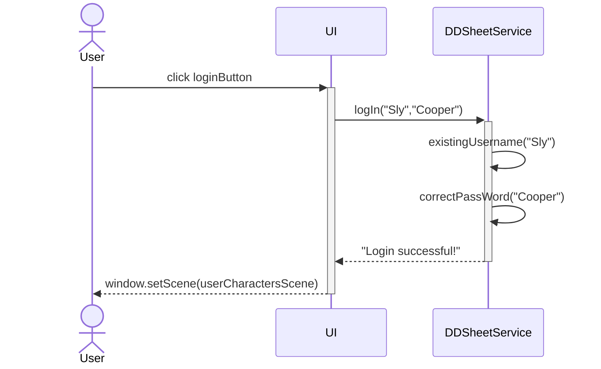
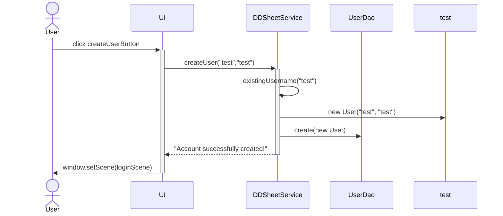
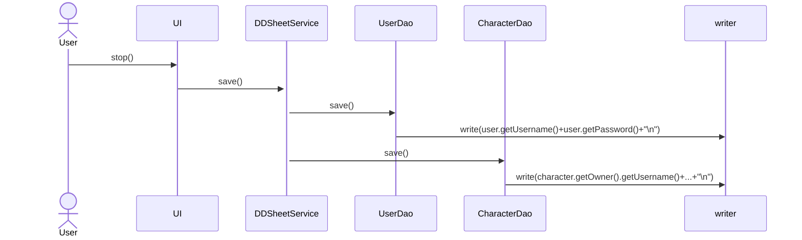

# Arkkitehtuurikuvaus

## Rakenne

UI sisältää sovelluksen käyttöliittymän koodin ja DDSheetService hoitaa suurimman osan ohjelman logiikasta. Sovelluksen alkaessa se hakee UserDaosta ja CharacterDaosta valmiiksi luodut oliot mikäli sellaisia on ja tallettavat ne sovelluksen sulkeutuessa.

Injektoinita on käytetty User- ja CharacterDaoitten liittyämisessa DDSheetServiceen.
FileUserDao on injektoitu FileCharacterDao:hon jotta hahmoja ladatessa saadaan linkitettyä hahmot oikeille omistajille.

## Käyttöliittymä

Käyttöliittymässä on seitsemän eri näkymää

-Kirjautumisnäkymä

-Uuden käyttäjän luonnin näkymä

-Käyttäjän hahmojen listan näkymän

-Uuden hahmon luonnin näkymän

-Hahmon tarkastelunäkymän

-Hahmon muokkausnäkymä

-Attribuutin muokkausnäkymän

Jokaisen näkymän luontiin on oma metodinsa esim. buildLogInScene, BuildCreateUserScene jne. Käyttäjän hahmojen listaa sekä hahmon tarkastelu- ja muokkausnäkymiä päivitetään niiden tietojen muuttuessa metodeilla updateUserCharactersGrid, updateInspectionViewGrid ja updateModificationViewGrid. Attribuutin muokkausnäkymää muokataan buildModificationView-metodilla, jotta jokaisen attribuutin muokkaamiselle ei tarvitse luoda uutta Scene-oliota.

## Päätoiminnallisuudet

#### Käyttäjän kirjautuminen

Login-nappia painamalla DDSheetServicen login-metodi kutsuu muita metodeja 
kirjautumistietojen varmentamiseen jonka jälkeen UI vaihtaa näkymää mikäli ne olivat oikein.

#### Uuden käyttäjän luominen

Uutta käyttäjää luotaessa UI kutsuu DDSheetServicea, joka tarkistaa että käyttäjänimi on saatavilla ja kummatkin arvot ovat tarpeeksi pitkiä.
Tämän jälkeen palautetaan String-esitys tuloksesta ja mikäli tili saatiin luotua, vaihdetaan kirjautumisnäkymään.

#### Uuden hahmon luominen

Uusi hahmo luodaan siihen tarkoitetusta näkymästä. Create new character-napista DDSheetService tarkistaa, että hahmon nimi on ainakin yhden merkin pituinen.
Jos hahmon nimi oli validi, lisätään kyseinen hahmo käyttäjän hahmolistaan ja CharacterDaon listaan.

#### Hahmon poistaminen

Hahmo poistetaan sen vieressä olevasta Delete-napista, jolloin DDSheetService poistaa hahmon nykyisen käyttäjän listasta ja CharacterDaon listasta.

#### Hahmon muokkaaminen

Hahmon muokkaamiseen on oma näkymänsä, jonka teksti vaihtelee muokattavan ominaisuuden mukaan. 
Modify-napista DDSheetService yrittää hahmon ominaisuuden muokkaamista ja syötteen ollessa oikeanlainen vaihtaa hahmon arvoja.

### Hahmojen ja käyttäjien tallentaminen

Kun ohjelmaa pyrkii sammuttamaan, käynnistää UIn stop-metodi, joka kutsuu DDSheetServicen save-metodia.
Save-metodi kutsuu edelleen UserDao- ja CharacterDao-olioiden save-metodeja, jotka tallentavat käyttäjien ja hahmojen tiedot pysyväistallennukseen.

## Heikkoudet/Parantamisehdotukset

#### Pysyväistallennus

Pysyväistallennus muistuttaa paljon referenssisovelluksen toteutusta. 
Aiheeltaan projektit ovat melko samantyylisiä, mutta ajan puutteen vuoksi en päässyt käyttämää SQLiteä niin kuin olin alun perin suunnitellut.

#### Toiminnallisuus

Itse hahmojen ominaisuuksilla ei voi tehdäö mitään. 
Jonkinlaista attribuuttien avulla laskemista tai skill checkien simuloimista olisi voinut tehdä. 
Tällä hetkellä projekti on yksinkertaisempi kuin perinteinen hahmotaulukko.
