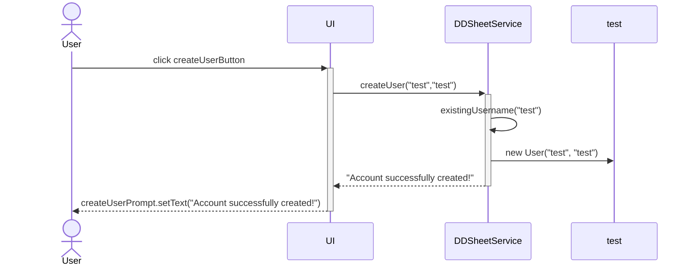

# Arkkitehtuurikuvaus

### Pakkauskaavio

### Sekvenssikaavio

Sekvenssikaavio kuvastaa uuden käyttäjän luomista

```mermaid
sequenceDiagram
    actor User
    participant UI
    participant DDSheetService
    User->>+UI: click createUserButton
    UI->>+DDSheetService: createUser("test","test")
    DDSheetService->>DDSheetService: existingUsername("test")
    DDSheetService->>test: new User("test", "test")
    DDSheetService-->>-UI: "Account successfully created!"
    UI-->>-User: createUserPrompt.setText("Account successfully created!")
```
