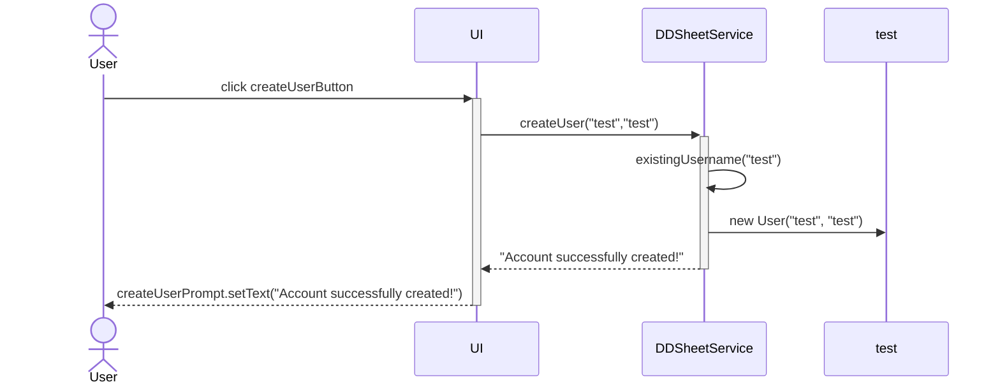

# Arkkitehtuurikuvaus

## Pakkauskaavio

## Sekvenssikaavio

Sekvenssikaavio kuvastaa uuden käyttäjän luomista

## Käyttöliittymä

Käyttöliittymässä on seitsemän eri näkymää

-Kirjautumisnäkymä

-Uuden käyttäjän luonnin näkymä

-Käyttäjän hahmojen listan näkymän

-Uuden hahmon luonnin näkymän

-Hahmon tarkastelunäkymän

-Hahmon muokkausnäkymä

-Attribuutin muokkausnäkymän

Jokaisen näkymän luontiin on oma metodinsa esim. buildLogInScene, BuildCreateUserScene jne. Käyttäjän hahmojen listaa sekä hahmon tarkastelu- ja muokkausnäkymiä päivitetään niiden tietojen muuttuessa metodeilla updateUserCharactersGrid, updateInspectionViewGrid ja updateModificationViewGrid. Attribuutin muokkausnäkymää muokataan buildModificationView-metodilla, jotta jokaisen attribuutin muokkaamiselle ei tarvitse luoda uutta Scene-oliota.
